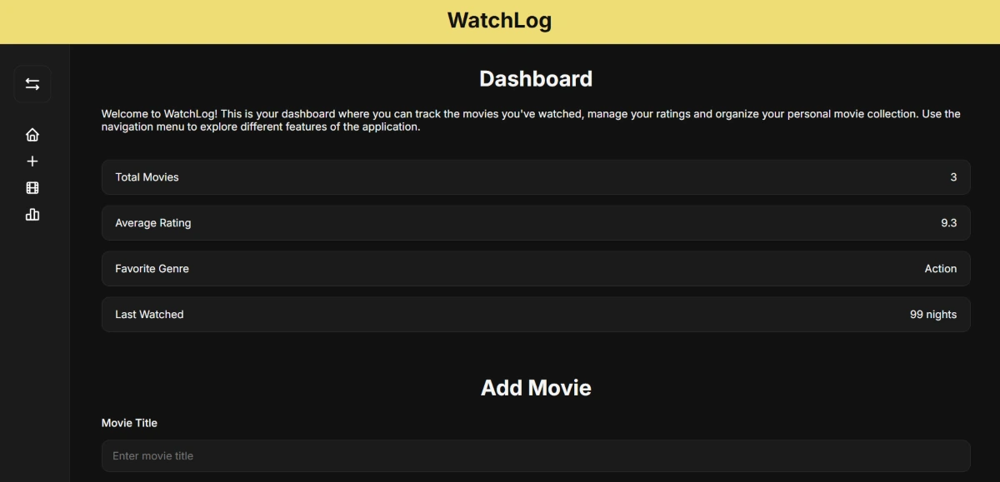

# Watchlog

WatchLog is a movie tracking application that allows users to build and manage their personal movie collection. The app provides movie management, advanced search, sorting options, and viewing statistics, all stored locally in the browser.

## Tech Stack

## Features

### Movie Management

- Add movies to your collection
- Edit existing movies
- Delete movies from your collection
- Track watch dates, ratings, and genres
- Automatic Local Storage persistence

### Search & Sorting

- Search by movie title
- Search by genre
- Sort movies alphabetically (A-Z / Z-A)
- Sort by rating
- Sort by watch date

### Statistics Dashboard

- Total movies tracked
- Average movie rating
- Most watched genre
- Top rated movies ranking
- Movies watched today, this month and this year
- Genre distribution chart

### Data Management

- Export collection to JSON
- Import collection from JSON
- Backup and restore movie data

### User Experience

- Responsive design for desktop and mobile devices
- Collapsible sidebar navigation
- Smooth animations and transitions
- Accessible and user-friendly interface

## Live Demo

https://movie-manager-jj.infinityfreeapp.com

## Preview

## Project Goals

### This project was built to practice:

- JavaScript DOM manipulation
- Local Storage management
- Data filtering and sorting
- Responsive web design
- Dynamic UI rendering
- CRUD operations
